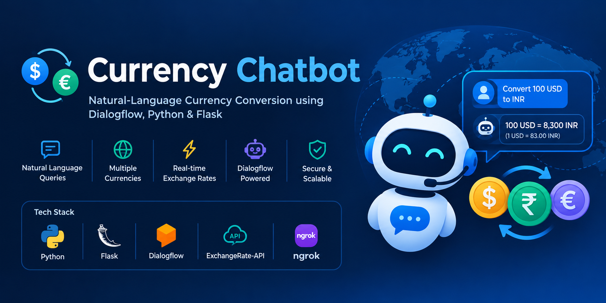

<p align="center">
  
</p>

# 💱 Currency Chatbot

### Natural-Language Currency Conversion using Dialogflow, Python & Flask

A conversational currency conversion chatbot that allows users to request currency conversions using **natural language**.

The chatbot uses **Dialogflow** to understand user requests, a **Flask webhook** to process the request, and **ExchangeRate-API** to retrieve exchange-rate data and calculate the converted amount.

---

## 🚀 Overview

Currency conversion is often performed through websites or dedicated applications. This project provides a simpler conversational approach where users can ask for conversions naturally, such as:

> "Convert 100 USD to INR"

> "How much is 50 EUR in GBP?"

The request is interpreted by Dialogflow and sent to the Python Flask backend, which retrieves the required exchange rate and returns the conversion result.

---

## ✨ Features

* 💬 Natural-language currency queries
* 💱 Currency-to-currency conversion
* 🌍 Support for multiple international currencies
* ⚡ Exchange rates retrieved through ExchangeRate-API
* 🤖 Dialogflow-powered intent recognition
* 🐍 Python Flask webhook backend
* 🔗 ngrok integration for local webhook testing
* 🔐 Environment variables for API credentials
* 🧩 Simple and lightweight architecture

---

## 🏗️ System Architecture

```text
                    ┌─────────────────┐
                    │      User       │
                    └────────┬────────┘
                             │
                             ▼
                    ┌─────────────────┐
                    │    Dialogflow   │
                    │ NLP / Intents   │
                    └────────┬────────┘
                             │
                             ▼
                    ┌─────────────────┐
                    │      ngrok      │
                    │ Public Webhook  │
                    └────────┬────────┘
                             │
                             ▼
                    ┌─────────────────┐
                    │  Flask Webhook  │
                    │     app.py      │
                    └────────┬────────┘
                             │
                             ▼
                    ┌─────────────────┐
                    │ ExchangeRate-API│
                    │ Exchange Rates  │
                    └────────┬────────┘
                             │
                             ▼
                    ┌─────────────────┐
                    │    Currency     │
                    │   Conversion    │
                    └────────┬────────┘
                             │
                             ▼
                    ┌─────────────────┐
                    │ Dialogflow      │
                    │    Response     │
                    └────────┬────────┘
                             │
                             ▼
                    ┌─────────────────┐
                    │      User       │
                    └─────────────────┘
```

---

## 🧰 Tech Stack

| Technology           | Purpose                                                        |
| -------------------- | -------------------------------------------------------------- |
| **Python**           | Core programming language                                      |
| **Flask**            | Webhook backend                                                |
| **Dialogflow**       | Natural-language processing and intent detection               |
| **ExchangeRate-API** | Exchange-rate data                                             |
| **REST API**         | Communication with the exchange-rate service                   |
| **ngrok**            | Exposes local Flask server to the internet for webhook testing |
| **Git & GitHub**     | Version control and project hosting                            |

---

## 📁 Project Structure

```text
Currency-Chatbot/
│
├── app.py
├── requirements.txt
├── .gitignore
├── .env
└── venv/
```

### File Description

* `app.py` — Flask application and Dialogflow webhook logic
* `requirements.txt` — Python dependencies
* `.env` — Stores API credentials and configuration locally
* `.gitignore` — Prevents sensitive files and unnecessary files from being committed
* `venv/` — Python virtual environment

> ⚠️ `.env` and `venv/` should not be uploaded to GitHub.

---

## ⚙️ How It Works

### 1. User Sends a Query

The user enters a natural-language request such as:

```text
Convert 100 USD to INR
```

### 2. Dialogflow Understands the Request

Dialogflow identifies the user's intent and extracts the required parameters, such as:

```text
Amount
Source Currency
Target Currency
```

### 3. Dialogflow Calls the Flask Webhook

The request is forwarded to the Flask backend through the webhook URL.

### 4. Flask Processes the Request

The Flask application:

* Reads the parameters received from Dialogflow
* Sends a request to ExchangeRate-API
* Retrieves the exchange rate
* Calculates the converted amount

### 5. Response is Returned

The Flask webhook sends the result back to Dialogflow.

Dialogflow then presents the conversion result to the user.

---

## 🔑 Environment Variables

Create a `.env` file in the project root:

```env
EXCHANGE_RATE_API_URL=your_api_url
EXCHANGE_RATE_API_KEY=your_api_key
```

Keep your API credentials private and never commit the `.env` file to GitHub.

---

## 🛠️ Installation & Setup

### 1. Clone the Repository

```bash
git clone https://github.com/shobhitag001/Currency-Chatbot.git
cd Currency-Chatbot
```

### 2. Create a Virtual Environment

```bash
python -m venv venv
```

Activate it on Windows:

```bash
venv\Scripts\activate
```

### 3. Install Dependencies

```bash
pip install -r requirements.txt
```

### 4. Configure Environment Variables

Create your `.env` file and add the required ExchangeRate-API configuration.

### 5. Start the Flask Server

```bash
python app.py
```

The Flask application will run locally.

### 6. Expose the Webhook

Use ngrok to expose the local Flask server:

```bash
ngrok http 5000
```

Copy the HTTPS forwarding URL and configure it as the **Dialogflow fulfillment webhook URL**.

---

## 💬 Example Queries

The chatbot can process natural-language requests such as:

```text
Convert 100 USD to INR
```

```text
What is 50 EUR worth in GBP?
```

```text
Convert 1000 INR to USD
```

```text
How much is 5000 JPY in INR?
```

The exact supported currencies depend on the configured exchange-rate service.

---

## 🔄 Request Flow

```text
User Query
    ↓
Dialogflow Intent Detection
    ↓
Parameter Extraction
    ↓
Flask Webhook
    ↓
ExchangeRate-API
    ↓
Exchange Rate
    ↓
Currency Calculation
    ↓
Webhook Response
    ↓
Dialogflow
    ↓
User
```

---

## 🎯 Project Goals

This project demonstrates how to integrate:

* Conversational AI
* Natural-language understanding
* REST APIs
* Python backend development
* Webhooks
* Third-party API integration
* Environment-based configuration

It is designed as a practical example of building a **real-time conversational application with external API integration**.

---

## 🔮 Future Improvements

* Add more currency-related commands
* Improve error handling for invalid currencies
* Add conversation history
* Add exchange-rate comparison
* Add a web-based interface
* Add deployment support for cloud platforms
* Improve response formatting

---

## 👨‍💻 Author

**Shobhit Agrawal**

GitHub: **@shobhitag001**

---

## 📄 License

This project is open source and available under the **MIT License**.
